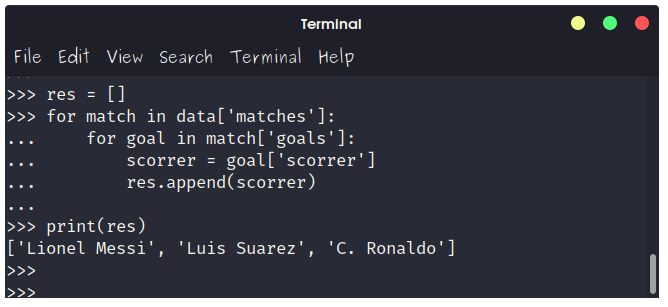
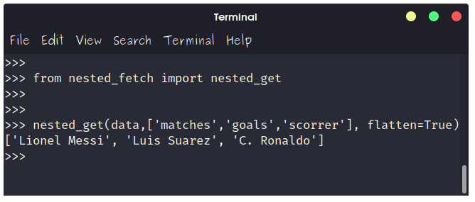

# ℕ𝕖𝕤𝕥𝕖𝕕𝔽𝕖𝕥𝕔𝕙
[](https://travis-ci.org/saintlyzero/NestedFetch)  

## Outline

1. [Overview](#overview)
2. [Installation](#installation)
3. [Usage](#usage)
4. [Examples](#examples)
    1. [Fetch Value](#fetch-data)
    2. [Set Value](#set--update--data)
5. [How to Contribute](#how-to-contribute)

## Overview
**NestedFetch** provides syntactic sugar 🍬 to deal with nested python `dictionary` and `list`  🐍.<br>
You can `get`, `set`, `update` and `flatten`  values from deeply nested dictionaries and lists with a more concise, easier and a more `KeyError`, `IndexError` free way 😌.  

```python
data = {
        "league": "Champions League",
        "matches": [
            {
                "match_id": "match_1",
                "goals": [
                {
                    "time": 13,
                    "scorrer": "Lionel Messi",
                    "assist": "Luis Suarez"
                },
                {
                    "time": 78,
                    "scorrer": "Luis Suarez",
                    "assist": "Ivan Rakitic"
                }]
            },
            {
                "match_id": "match_2",
                "goals": [
                {
                    "time": 36,
                    "scorrer": "C. Ronaldo",
                    "assist": "Luka Modric"
                }]
            }]
        }
```

|  |  |
|--|--|
|  |
## Installation

**NestedFetch** works with Python3. <br>You can install it via **pip**<br>
```pip3 install nestedfetch```

## Usage

Import the methods from the package. 

```python3
from nested_fetch import nested_get, nested_set
```

No need to instantiate any object, just use the methods specifying valid parameters.

## Examples

### Fetch Data

```python
nested_get(data, keys, default=None, flatten=False)

@Arguments
data : dict / list
keys => List of sequential keys leading to the desired value to fetch
default => Specifies the default value to be returned if any specified key is not present. If not specified, it will be None
flatten => Specifies whether to flatten the returned value

@Return
Returns the fetched value if it exists, or returns specified default value
```

1. Fetching simple nested data :

```python
data = {
            'name': 'Jesse Pinkman',
            'details': {
                'address':{
                    'city': 'Albuquerque'
                }
            }
        }
res = nested_get(data,['details','address','city'])
# res = Albuquerque
```

2. Fetching simple nested data with `default` value:

```python
data = {
            'name': 'Jesse Pinkman',
            'details': {
                'address':{
                    'city': 'Albuquerque'
                }
            }
        }
res = nested_get(data,['details','address','state'], default=-1)
# res = -1
```

3. Fetching nested data:

```python
data = {
            'name': 'Jesse Pinkman',
            'details': {
                'address':[{
                    'city': 'Albuquerque'
                },{
                    'city': 'El Paso'
                }]
            }
        }
res = nested_get(data,['details','address','city'])
# res = ['Albuquerque','El Paso']
```

4. Fetching nested data with `default` value:

```python
data = {
            'name': 'Jesse Pinkman',
            'details': {
                'address':[{
                    'city': 'Albuquerque'
                },{
                    'city': 'El Paso'
                },{
                    'state': 'New Mexico'
                }]
            }
        }
res = nested_get(data,['details','address','city'], default= None)
# res = ['Albuquerque','El Paso', None]
```

5. Fetching nested data by specifing `index`:

```python
data = {
            'name': 'Walter White',
            'details': {
                'address':[{
                    'city': 'Albuquerque'
                },{
                    'city': 'El Paso'
                }]
            }
        }
res = nested_get(data,['details','address','city', 0])
# res = Albuquerque
```

6. Fetching nested data without `flatten`:

```python
data = {
        "league": "Champions League",
        "matches": [
            {
                "match_id": "match_1",
                "goals": [
                {
                    "time": 13,
                    "scorrer": "Lionel Messi",
                    "assist": "Luis Suarez"
                },
                {
                    "time": 78,
                    "scorrer": "Luis Suarez",
                    "assist": "Ivan Rakitic"
                }]
            },
            {
                "match_id": "match_2",
                "goals": [
                {
                    "time": 36,
                    "scorrer": "C. Ronaldo",
                    "assist": "Luka Modric"
                }]
            }]
        }
res = nested_get(data,['matches','goals','scorrer'])
# res = [['Lionel Messi', 'Luis Suarez'], ['C. Ronaldo']]
```

8. Fetching nested data with `flatten`:

```python
data = {
        "league": "Champions League",
        "matches": [
            {
                "match_id": "match_1",
                "goals": [
                {
                    "time": 13,
                    "scorrer": "Lionel Messi",
                    "assist": "Luis Suarez"
                },
                {
                    "time": 78,
                    "scorrer": "Luis Suarez",
                    "assist": "Ivan Rakitic"
                }]
            },
            {
                "match_id": "match_2",
                "goals": [
                {
                    "time": 36,
                    "scorrer": "C. Ronaldo",
                    "assist": "Luka Modric"
                }]
            }]
        }
res = nested_get(data,['matches','goals','scorrer'], flatten=True)
# res = ['Lionel Messi', 'Luis Suarez', 'C. Ronaldo']
```

### Set / Update  Data

```python
nested_set(data, keys, value, create_missing=False):

@Arguments
data => dict / list
keys => List of sequential keys leading to the desired value to set / update
value => Specifies the value to set / update
create_missing => Specifies whether to create new key while building up if the specified key does not exists

@Return
Returns the number of values updated
```


1. Setting simple nested data :

```python
data = {
            'name': 'Jesse Pinkman',
            'details': {
                'address':{
                    'city': 'Albuquerque'
                }
            }
        }
res = nested_set(data,['details','address','city'], "Denver")
# res = 1

# data = {
#             'name': 'Jesse Pinkman',
#             'details': {
#                 'address':{
#                     'city': 'Denver'
#                 }
#             }
#         }

```

2. Setting nested data:

```python
data = {
            'name': 'Jesse Pinkman',
            'details': {
                'address':[{
                    'city': 'Albuquerque'
                },{
                    'city': 'El Paso'
                }]
            }
        }
res = nested_set(data,['details','address','city'], "Denver")
# res = 2

# data = {
#     'name': 'Jesse Pinkman',
#     'details': {
#         'address':[{
#             'city': 'Denver'
#         },{
#             'city': 'Denver'
#         }]
#     }
# }
```

3. Setting nested data with Index:

```python
data = {
            'name': 'Jesse Pinkman',
            'details': {
                'address':[{
                    'city': 'Albuquerque'
                },{
                    'city': 'El Paso'
                }]
            }
        }
res = nested_set(data,['details','address',0,'city'], "Denver")
# res = 1

# data = {
#     'name': 'Jesse Pinkman',
#     'details': {
#         'address':[{
#             'city': 'Denver'
#         },{
#             'city': 'El Paso'
#         }]
#     }
# }
```

4. Setting nested data with `create_missing` :

```python
data = {
            'name': 'Jesse Pinkman',
            'details': {
                'address':{
                    'city': 'Albuquerque'
                }
            }
        }
res = nested_set(data,['details','address','state'], "New Mexico", create_missing=True)
# res = 1

# data = {
#             'name': 'Jesse Pinkman',
#             'details': {
#                 'address':{
#                     'city': 'Denver',
#                     'state': 'New Mexico'
#                 }
#             }
#         }

```

## How to contribute

Contributions are welcomed and anyone can feel free to submit a patch, report a bug or ask for a feature. <br>Please open an issue first in order to encourage and keep tracks of potential discussions